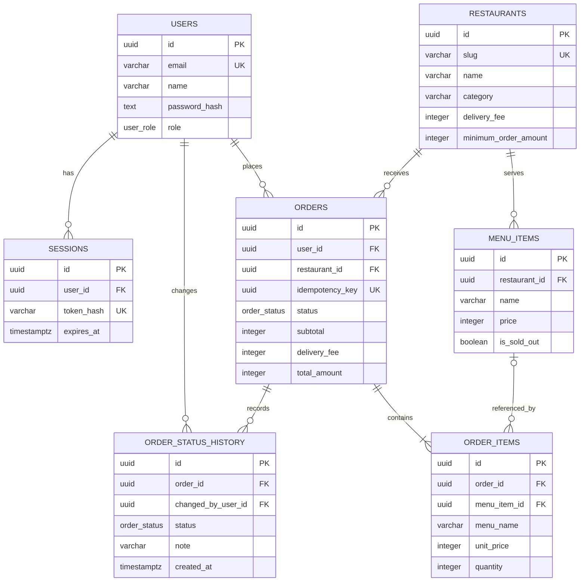

# 데이터베이스 구조와 설계 이유

## 발표용 ERD — 핵심 컬럼과 PK/FK

- `PK`: 각 행을 유일하게 구분하는 기본키
- `FK`: 다른 테이블의 PK를 참조하는 외래키
- `UK`: 중복 저장을 막는 고유키

## 테이블별 키와 역할

| 테이블 | PK | 주요 FK | 한 줄 역할 |
| --- | --- | --- | --- |
| `users` | `id` | 없음 | 로그인 계정, 비밀번호 해시, 고객/관리자 역할을 저장한다. |
| `sessions` | `id` | `user_id → users.id` | 사용자별 로그인 세션의 토큰 해시와 만료 시각을 저장한다. |
| `restaurants` | `id` | 없음 | 식당의 카테고리, 배달비, 최소 주문 금액, 예상 시간을 저장한다. |
| `menu_items` | `id` | `restaurant_id → restaurants.id` | 각 식당이 판매하는 메뉴와 현재 가격, 품절 여부를 저장한다. |
| `orders` | `id` | `user_id → users.id` `restaurant_id → restaurants.id` | 주문자·식당·배송지·합계·현재 상태·중복 방지 키를 저장한다. |
| `order_items` | `id` | `order_id → orders.id` `menu_item_id → menu_items.id` | 주문에 포함된 메뉴의 이름·단가 스냅샷과 수량을 저장한다. |
| `order_status_history` | `id` | `order_id → orders.id` `changed_by_user_id → users.id` | 상태가 언제 누구에 의해 변경됐는지 시간순으로 저장한다. |

## 관계 한눈에 보기

| 관계 | 형태 | 이 관계가 필요한 이유 |
| --- | --- | --- |
| `users.id → sessions.user_id` | 사용자 1 : 세션 N | 한 사용자가 여러 기기에서 각각 로그인할 수 있다. |
| `users.id → orders.user_id` | 사용자 1 : 주문 N | 내 주문 내역을 현재 로그인 사용자 기준으로 조회한다. |
| `restaurants.id → menu_items.restaurant_id` | 식당 1 : 메뉴 N | 한 식당이 여러 메뉴를 판매한다. |
| `restaurants.id → orders.restaurant_id` | 식당 1 : 주문 N | 주문이 어느 식당에 들어왔는지 구분한다. |
| `orders.id → order_items.order_id` | 주문 1 : 주문항목 N | 한 주문에 여러 메뉴와 수량을 담는다. |
| `orders.id → order_status_history.order_id` | 주문 1 : 상태이력 N | 현재 상태뿐 아니라 접수부터 완료까지 변경 과정을 보존한다. |
| `menu_items.id → order_items.menu_item_id` | 메뉴 1 : 주문항목 N | 현재 메뉴와 연결하며, 삭제 시 FK만 `NULL`이 되고 주문 스냅샷은 남는다. |

> 발표에서는 `users → orders → order_items`를 먼저 따라가며 “누가 주문했고, 한 주문에 어떤 메뉴가 들어갔는지”를 설명한 뒤, `restaurants → menu_items`와 `orders → order_status_history`를 설명하면 관계가 가장 쉽게 보인다.

## 왜 이렇게 나눴는가

### 주문과 주문 상세

주문 한 건에는 메뉴가 여러 개 들어간다. 배송지와 총액처럼 주문 전체에 한 번만 필요한 값은 `orders`에 두고, 메뉴마다 반복되는 이름·단가·수량은 `order_items`에 둔다. 이 구조는 주문에 메뉴가 몇 개 들어가더라도 중복 없이 표현할 수 있다.

`order_items`에는 `menu_item_id`뿐 아니라 주문 당시의 `menu_name`과 `unit_price`도 저장한다. 메뉴 이름이나 가격이 나중에 바뀌어도 주문 당시 결제 기록이 변하지 않게 하기 위해서다. 운영 중에는 실제 삭제보다 `is_sold_out`으로 품절 처리하고, 메뉴가 삭제되더라도 `ON DELETE SET NULL`에 따라 `menu_item_id` 연결만 `NULL`이 되며 스냅샷은 남는다.

### 장바구니와 주문

장바구니는 주문 확정 전의 임시 상태이므로 `cart`나 `cart_items` 테이블에 영구 저장하지 않고 브라우저 `localStorage`의 클라이언트 상태로 관리한다. 사용자가 주문하기를 누르면 서버가 식당·메뉴·현재 가격·품절 여부를 다시 검증한 뒤 `orders`, `order_items`, `order_status_history`에 영구 저장한다.

### 현재 상태와 상태 이력

목록을 빠르게 조회할 때는 `orders.status`만 보면 된다. 반면 상태가 변경된 과정은 `order_status_history`에 별도로 쌓는다. 현재 상태 조회 성능과 변경 이력 보존을 동시에 얻기 위한 의도적인 중복이다.

### 사용자와 세션

`users`에는 계정 정보를, `sessions`에는 로그인 상태를 분리해 저장한다. 사용자는 여러 기기에서 로그인할 수 있고 각 세션은 서로 다른 만료 시각을 갖기 때문이다. 브라우저에는 원본 세션 토큰을 보내지만 DB에는 해시만 저장해 DB가 노출되더라도 토큰을 바로 사용할 수 없게 한다.

## 주문 저장 순서

1. 서버가 로그인 사용자와 장바구니의 식당·메뉴를 다시 조회한다.
2. 현재 가격, 품절, 최소 주문 금액을 서버 기준으로 검증한다.
3. 서버가 상품 합계와 배달비, 최종 금액을 다시 계산한다.
4. 하나의 DB 트랜잭션 안에서 `orders` 한 행을 만든다.
5. 같은 트랜잭션에서 `order_items` 여러 행과 최초 상태 이력을 만든다.
6. 모든 저장이 성공하면 커밋하고, 하나라도 실패하면 전체를 롤백한다.

트랜잭션을 사용하는 이유는 주문만 있고 메뉴가 없거나, 메뉴 일부만 저장된 반쪽짜리 주문을 방지하기 위해서다.

`orders.id`는 주문 자체를 식별하고, 이와 별도로 주문서를 열 때 생성한 UUID 형식의 요청 키를 `orders.idempotency_key`에 저장한다. 이 열의 고유 제약과 서버의 기존 주문 조회를 함께 사용하므로 같은 키의 요청이 재전송되면 새 주문을 만들지 않고 기존 주문 상세로 이동한다. 즉 서로 다른 주문까지 막는 것이 아니라 동일한 제출 요청의 중복 저장을 방어한다.

## 무결성 규칙

- 이메일, 식당 slug, 주문번호, 주문 요청 키는 중복될 수 없다.
- 가격과 배달비, 최소 주문 금액은 음수가 될 수 없다.
- 주문 수량은 반드시 1개 이상이다.
- 주문 총액은 상품 합계와 배달비의 합이어야 한다.
- 최대 배달 예상 시간은 최소 예상 시간보다 작을 수 없다.
- 사용자별 주문내역과 식당별 주문 조회를 위한 복합 인덱스를 둔다.

## 로컬과 운영 환경

로컬에서는 Docker의 PostgreSQL을 사용하고, 운영에서는 Neon PostgreSQL을 사용한다. 두 환경 모두 같은 Drizzle 마이그레이션 파일을 적용하므로 스키마 차이로 생기는 배포 오류를 줄일 수 있다.
