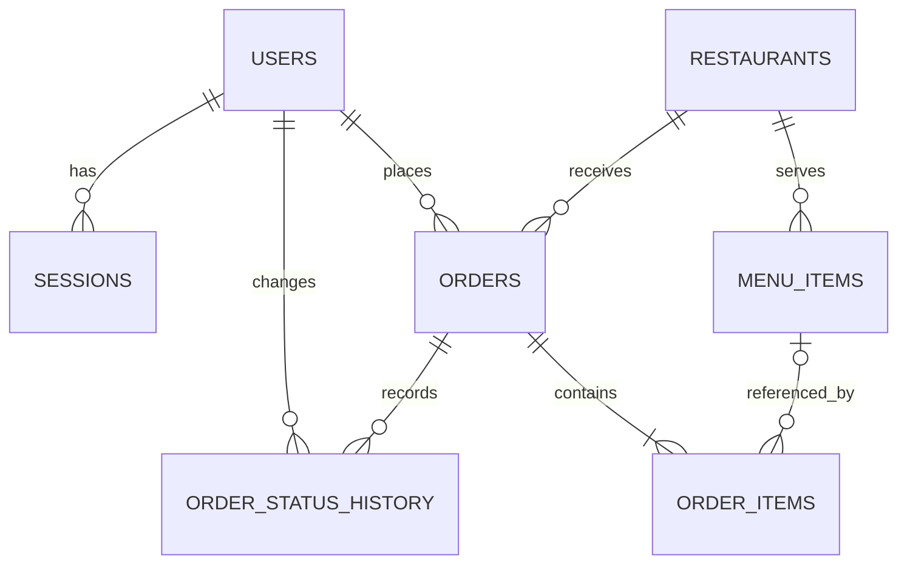

# 데이터베이스 구조와 설계 이유

## 관계 구조

## 테이블별 역할

| 테이블 | 한 줄 설명 |
| --- | --- |
| `users` | 로그인 계정, 비밀번호 해시, 고객/관리자 역할을 저장한다. |
| `sessions` | 로그인 상태를 유지하기 위한 세션 토큰 해시와 만료 시각을 저장한다. |
| `restaurants` | 식당의 카테고리, 배달비, 최소 주문 금액, 예상 시간을 저장한다. |
| `menu_items` | 각 식당이 판매하는 메뉴와 현재 가격, 품절 여부를 저장한다. |
| `orders` | 누가 어느 식당에 주문했는지와 배송지, 합계, 현재 상태를 저장한다. |
| `order_items` | 한 주문에 포함된 여러 메뉴의 이름·단가 스냅샷과 수량을 저장한다. |
| `order_status_history` | 주문 상태가 언제 누구에 의해 바뀌었는지 시간순으로 저장한다. |

## 왜 이렇게 나눴는가

### 주문과 주문 상세

주문 한 건에는 메뉴가 여러 개 들어간다. 배송지와 총액처럼 주문 전체에 한 번만 필요한 값은 `orders`에 두고, 메뉴마다 반복되는 이름·단가·수량은 `order_items`에 둔다. 이 구조는 주문에 메뉴가 몇 개 들어가더라도 중복 없이 표현할 수 있다.

`order_items`에는 `menu_item_id`뿐 아니라 주문 당시의 `menu_name`과 `unit_price`도 저장한다. 식당이 나중에 메뉴 이름이나 가격을 바꾸거나 메뉴를 삭제해도 이미 결제한 과거 주문 기록이 바뀌면 안 되기 때문이다. 메뉴가 삭제되면 외래키만 `NULL`이 되고 스냅샷은 남는다.

### 현재 상태와 상태 이력

목록을 빠르게 조회할 때는 `orders.status`만 보면 된다. 반면 상태가 변경된 과정은 `order_status_history`에 별도로 쌓는다. 현재 상태 조회 성능과 변경 이력 보존을 동시에 얻기 위한 의도적인 중복이다.

### 사용자와 세션

`users`에는 계정 정보를, `sessions`에는 로그인 상태를 분리해 저장한다. 사용자는 여러 기기에서 로그인할 수 있고 각 세션은 서로 다른 만료 시각을 갖기 때문이다. 브라우저에는 원본 세션 토큰을 보내지만 DB에는 해시만 저장해 DB가 노출되더라도 토큰을 바로 사용할 수 없게 한다.

## 주문 저장 순서

1. 서버가 로그인 사용자와 장바구니의 식당·메뉴를 다시 조회한다.
2. 현재 가격, 품절, 최소 주문 금액을 서버 기준으로 검증한다.
3. 서버가 상품 합계와 배달비, 최종 금액을 다시 계산한다.
4. 하나의 DB 트랜잭션 안에서 `orders` 한 행을 만든다.
5. 같은 트랜잭션에서 `order_items` 여러 행과 최초 상태 이력을 만든다.
6. 모든 저장이 성공하면 커밋하고, 하나라도 실패하면 전체를 롤백한다.

트랜잭션을 사용하는 이유는 주문만 있고 메뉴가 없거나, 메뉴 일부만 저장된 반쪽짜리 주문을 방지하기 위해서다.

## 무결성 규칙

- 이메일, 식당 slug, 주문번호는 중복될 수 없다.
- 가격과 배달비, 최소 주문 금액은 음수가 될 수 없다.
- 주문 수량은 반드시 1개 이상이다.
- 주문 총액은 상품 합계와 배달비의 합이어야 한다.
- 최대 배달 예상 시간은 최소 예상 시간보다 작을 수 없다.
- 사용자별 주문내역과 식당별 주문 조회를 위한 복합 인덱스를 둔다.

## 로컬과 운영 환경

로컬에서는 Docker의 PostgreSQL을 사용하고, 운영에서는 Neon PostgreSQL을 사용한다. 두 환경 모두 같은 Drizzle 마이그레이션 파일을 적용하므로 스키마 차이로 생기는 배포 오류를 줄일 수 있다.
